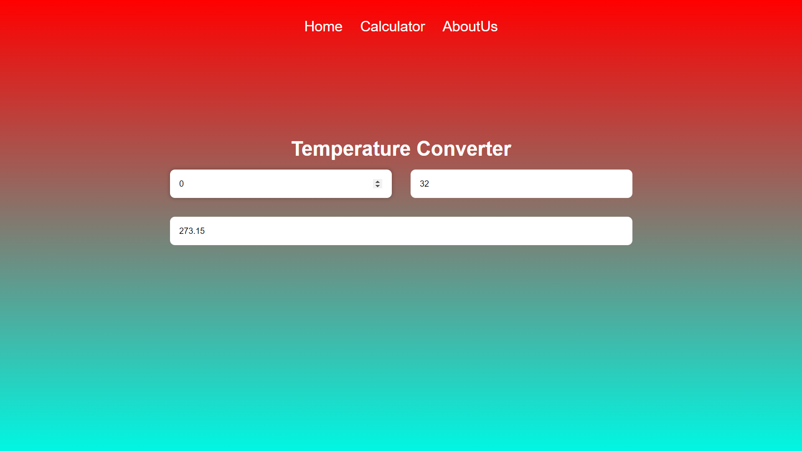
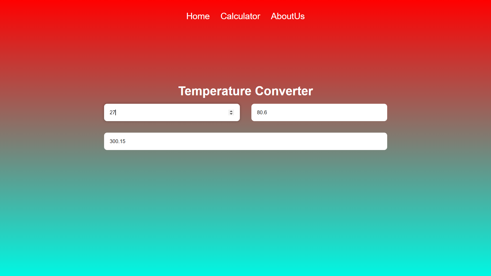

# Temperature-Convertor

###### In this project, I have made a Temperature convertor website using HTML, CSS and JavaScript.

* 1st input is Celcius
* 2nd input is Fahrenheit
* 3rd input is Kelvin

